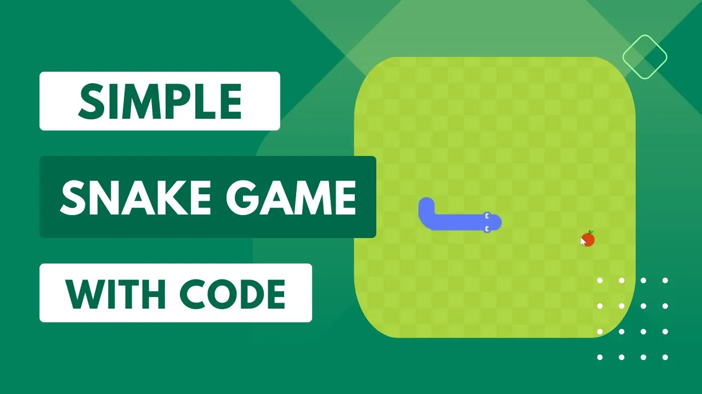
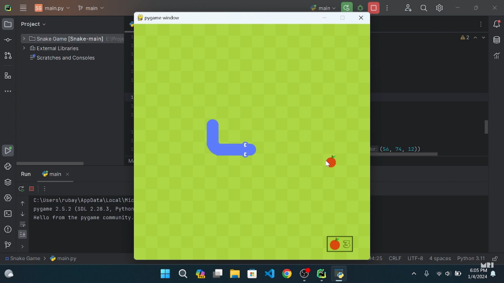

# Snake and Apple Game

Welcome to the Snake and Apple game, a classic and addictive game built with Python and PyCharm!

## About
Snake and Apple is a traditional arcade game where players control a snake to eat apples and grow longer while avoiding obstacles and the snake's own tail. It's a fun and challenging game that's perfect for all ages.

## Features
- Classic snake gameplay experience
- Colorful graphics and smooth animation
- Simple controls using arrow keys or WASD
- Increasing difficulty as the snake grows longer

## Installation
1. Clone the repository: `git clone https://github.com/yourusername/snake-and-apple-game.git`
2. Make sure you have Python installed on your system.
3. Run the game by executing the `snake_and_apple.py` file using Python.

## How to Play
- Use the arrow keys or WASD keys to control the snake's movement.
- Guide the snake to eat apples without colliding with the walls or its own tail.
- The snake grows longer each time it eats an apple, increasing the challenge.
- The game ends when the snake collides with a wall or itself.

## Screenshots

## Contributing
Contributions are welcome! If you have any suggestions, bug fixes, or enhancements, feel free to submit a pull request.

## License
This project is licensed under the [MIT License](LICENSE).

---

Enjoy playing the Snake and Apple game! Don't forget to leave a star if you liked it!
